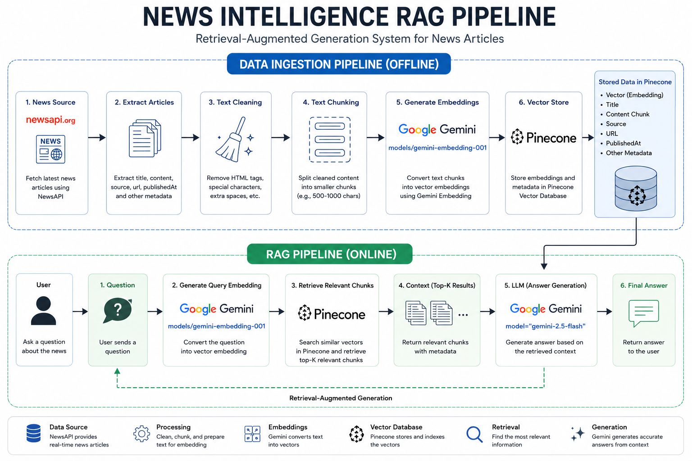

# News Intelligence RAG API

A Retrieval-Augmented Generation (RAG) system that collects the latest news articles from NewsAPI, transforms them into vector embeddings using Google Gemini Embeddings, stores them in Pinecone Vector Database, and provides intelligent question-answering through FastAPI.

---

# News RAG Pipeline



## Project Overview

This project demonstrates an end-to-end RAG pipeline consisting of:

1. News Extraction from NewsAPI
2. Text Cleaning and Processing
3. Gemini Embedding Generation
4. Pinecone Vector Storage
5. Semantic Retrieval
6. Gemini-powered Answer Generation
7. FastAPI REST API

The system allows users to ask questions about recent news articles and receive context-aware answers generated from retrieved documents.

---

## Architecture

```text
User Question
      │
      ▼
 FastAPI (/ask)
      │
      ▼
 Gemini Embedding
      │
      ▼
 Pinecone Retrieval
      │
      ▼
 Relevant News Articles
      │
      ▼
 Gemini LLM
      │
      ▼
 Final Answer
```

### Data Ingestion Pipeline

```text
NewsAPI
   │
   ▼
Extract
   │
   ▼
Clean Text
   │
   ▼
Chunking
   │
   ▼
Gemini Embedding
   │
   ▼
Pinecone Vector Database
```

---

## Tech Stack

### Backend

* Python
* FastAPI
* Uvicorn

### AI & RAG

* Google Gemini
* LangChain
* Pinecone

### Data Processing

* NewsAPI
* Python

### Deployment

* Docker
* Docker Compose

---

## Project Structure

```text
news-rag-pipeline/
│
├── src/
│   │
│   ├── api/
│   │   └── app.py
│   │
│   ├── chains/
│   │   └── rag_chain.py
│   │
│   ├── config/
│   │   └── settings.py
│   │
│   ├── embedding/
│   │   └── embedding_model.py
│   │
│   ├── ingestion/
│   │   └── news_api.py
│   │
│   ├── llm/
│   │   └── gemini_client.py
│   │
│   ├── processing/
│   │   ├── clean_text.py
│   │   ├── chunk_text.py
│   │   └── metadata.py
│   │
│   ├── retrieval/
│   │   └── retriever.py
│   │
│   ├── vectorstore/
│   │   └── pinecone_store.py
│   │
│   └── pipeline.py
│
├── docker/
│   └── Dockerfile
│
│
├── .env
├── requirements.txt
├── docker-compose.yml
├── README.md
└── main.py
```

---

## Features

### News Ingestion

Fetches the latest articles using NewsAPI.

### Text Processing

* Cleaning
* Chunking
* Metadata extraction

### Embedding Generation

Uses Gemini Embedding Model:

```text
models/embedding-001
```

### Vector Database

Stores embeddings in Pinecone.

### Semantic Search

Retrieves the most relevant documents using vector similarity search.

### Question Answering

Uses Gemini LLM to generate answers from retrieved context.

### REST API

Provides a FastAPI endpoint for querying news articles.

---

## Environment Variables

Create a `.env` file:

```env
NEWS_API_KEY=your_newsapi_key

GEMINI_API_KEY=your_gemini_api_key

PINECONE_API_KEY=your_pinecone_api_key

PINECONE_INDEX_NAME=news-rag-index
```

---

## Installation

### Clone Repository

```bash
git clone https://github.com/yourusername/news-rag-pipeline.git

cd news-rag-pipeline
```

### Create Virtual Environment

```bash
python -m venv .venv
```

### Activate Environment

Windows:

```bash
.venv\Scripts\activate
```

Linux/Mac:

```bash
source .venv/bin/activate
```

### Install Dependencies

```bash
pip install -r requirements.txt
```

---

## Populate Pinecone

Run the ingestion pipeline:

```bash
python main.py
```

This will:

1. Fetch news articles
2. Clean content
3. Generate embeddings
4. Upload vectors to Pinecone

---

## Run API Server

```bash
uvicorn src.api.app:app --reload
```

Server:

```text
http://127.0.0.1:8000
```

Swagger Documentation:

```text
http://127.0.0.1:8000/docs
```

---

## API Usage

### Ask Question

Endpoint:

```http
POST /ask
```

Request:

```json
{
  "question": "Apa berita terbaru tentang Donald Trump?"
}
```

Response:

```json
{
  "question": "Apa berita terbaru tentang Donald Trump?",
  "answer": "..."
}
```

---

## Example Questions

```text
Apa berita terbaru tentang Donald Trump?

Apa yang terjadi antara Giorgia Meloni dan Donald Trump?

Apa berita terbaru terkait konflik internasional?

Ringkas berita politik terbaru hari ini.
```

---

## Future Improvements

* Docker Deployment
* Scheduled News Updates
* Streamlit Frontend
* Authentication
* Monitoring and Logging
* Multi-source News Ingestion
* CI/CD Pipeline

---

## Learning Outcomes

This project demonstrates:

* ETL Pipeline Development
* API Integration
* Vector Databases
* Embedding Models
* Semantic Search
* Retrieval-Augmented Generation (RAG)
* FastAPI Development
* AI Application Engineering

---

## Author

Satria Nur Alfata Panca

Data Science Student | Aspiring Data Engineer | AI Enthusiast
